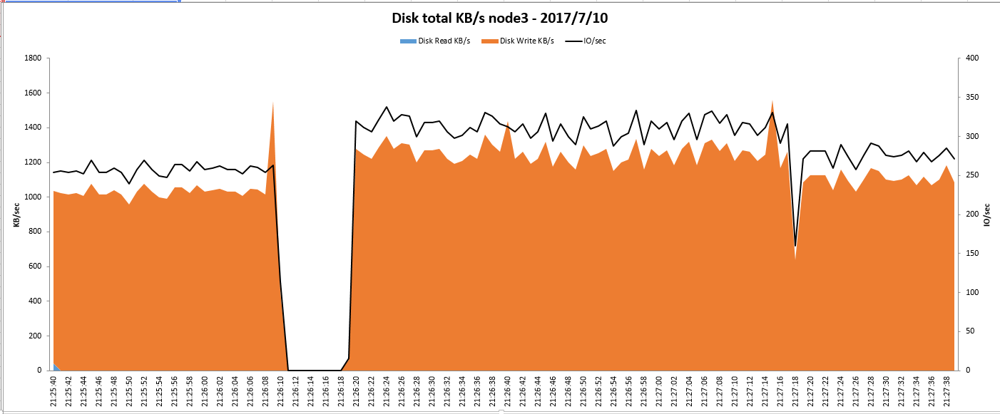

# ceph使用raid方案验证测试
ceph 集群在 osd 故障时会使集群 IO 中断，具体中断时间为　osd　的心跳间隔(默认为20秒)设置，在 7-20　秒之间。基于此问题，如果把 osd 放在 raid1 的阵列盘组上是否能够解决？此文档即为此方案的验证测试及结论。

## 1 环境准备

* 硬件环境

三台服务器配置如下
```
CPU   　: Intel(R) Xeon(R) CPU E5-2640 v4 @ 2.40GHz
MEM  　 : 256G
RAID卡　: SAS 2208
DISK1 　: SAS 600G X2 系统盘raid1
DISK2　 : SATA 2T X10 OSD两两做raid1
DISK3 　: SSD INTEL SSDSC2BB240G7 240GB X2 raid1　cache
```

* 软件
```
操作系统：　centos 7.2
ceph:   12.1.0
```

* 部署架构

10 块　SATA　每两块做　raid1 之后给　OSD 使用，两块　SSD　做　raid1 之后分为五等分，分别分配给每个　OSD　的　rocksdb 使用。
最终部署为，每台节点上有 5 个 OSD。

## 2 测试案例

部署好 ceph 集群后，测试两个场景，通过拔盘模拟坏盘的情况，一个是拔插　SATA 盘，　一个是拔插　SSD　盘，看对集群的影响，测试两个场景情况一样。这里主要介绍 SATA　场景情况分析。

### 2.1 拔插　SATA　盘

客户端使用 fio 对集群进行压测，拔掉一块　SATA　盘后，查看　FIO　的压测状态，发现会有８秒左右的中断，此时集群状态没有任何问题。拔掉盘对应的 osd 状态正常。



把 SATA　插回去后，对　ceph　没有影响，如果 raid 卡设置了　mantainpdfailhistory 则需要手动恢复，如果没有设置，则此时　raid　会进入自动恢复过程，但是所用时间会比较长，且随着硬盘的容量和数据的大小变化。下面为 2T 的容量 200G数据量的恢复时间估算。在有 FIO 压测时，时间会增长为 4 天 3 小时，停掉　FIO 则会变成 5 小时左右。

```
Controller = 0
Status = Success
Description = Show Drive Rebuild Status Succeeded.


----------------------------------------------------------
Drive-ID  Progress% Status      Estimated Time Left       
----------------------------------------------------------
/c0/e0/s2         0 In progress 4 Days 3 Hours 51 Minutes 
----------------------------------------------------------


Controller = 0
Status = Success
Description = Show Drive Rebuild Status Succeeded.


----------------------------------------------------
Drive-ID  Progress% Status      Estimated Time Left 
----------------------------------------------------
/c0/e0/s2         0 In progress 4 Hours 39 Minutes  
----------------------------------------------------

```
## 3 测试结论

ceph 使用　raid1 的盘组情况下与没有使用的情况下一致，没有改进，不建议使用 raid1 模式部署 ceph 。主要比较点如下

区别项目|ceph裸盘|ceph raid1|相比裸盘的优缺点|
-------|-------|----------|-------------|
对OSD进程的影响|ceph 会感知拔盘(坏盘场景),拔盘对 OSD 服务有影响,把坏盘 OSD 踢出集群 |ceph 不会感知拔盘(坏盘场景),拔盘对 OSD 服务没有影响|中性，没有意义|
对读性能的影响|ceph osd有主备设置，读取只发生在主osd上，所以三副本的配置就是三块盘只有一块提供读取|raid1之后，读取可以同时发生在raid1的两块盘，增加了读性能|优点|
对写性能的影响|ceph osd有主备设置，读取只发生在主osd上，所以三副本的配置就是三块盘只有一块提供写性能|raid1之后，两副本四块盘只有一块盘的写性能|缺点|
ceph的磁盘管理能力|ceph磁盘管理能力良好|减弱ceph对磁盘管理的能力，只能感知raid1之后的裸设备|缺点|
ceph的恢复能力影响|ceph的恢复能力正常，rabalance的过程可以通过QOS控制流速|坏磁盘的恢复依赖于 raid 卡，效率比较低，时间长|缺点|
对磁盘的利用率|三副本的利用率一般|磁盘利用率低，raid１　之后 2　副本,相比裸盘 3 副本利用率和提供的能力都低　|缺点|
对集群 IO　的影响|ceph IO 会照样中断　7 秒的时间,优化后OSD的心跳间隔|ceph IO 会照样中断　7-8 秒的时间，此情况正在与厂商沟通,了解细节|一样|

## 4 参考文档
- https://www.broadcom.com/products/storage/raid-on-chip/sas-2208#documentation
- http://support.huawei.com/enterprise/zh/doc/DOC1000004345
- https://en.wikipedia.org/wiki/Standard_RAID_levels#RAID_1
