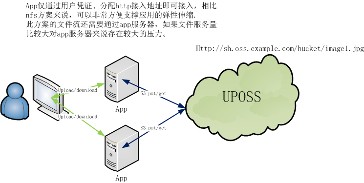

# 应用附件上传读取优化方案

一般文件上传下载的功能会集成进应用中,应用不仅处理其它业务活动,也担任文件的上传和下载服务功能.本文旨在探索在一个弹性的应用场景中如何优化应用文件的上传下载服务.

## 通用方案


此方案有如下问题

* 海量文件时,nas/nfs 存储扩容问题
* 数据库存文件对数据库的运维带来压力,性能也会大打折扣
* 外部访问接入时需要分发到各个apache节点，管理复杂
* 文件流都要经过app服务器，对app其它功能的影响
* 应用弹性伸缩的障碍(nfs挂载步骤）

## 对象存储是什么?


接入仅需如下凭证
```
User: test-user
Accesskey: test-key
Endpoint: Http://sh.oss.example.com/bucket
```


* 提供标准的RESTful API接口(s3/swift)，SDK包，可以像使用文件一样，方便上传/下载、检索、管理用于Web网站或者移动应用海量的数据
* 灵活的验证，授权机制。提供基于hmac的URL鉴权和授权机制;可定制白名单，防盗链等功能
* 可实现跨区域、中心复制，实现数据的容灾

## 对象存储改进方案一



* 提供标准的RESTful API接口(s3/swift)，SDK包，可以像使用文件一样，方便上传/下载、检索、管理用于Web网站或者移动应用海量的数据
* 灵活的验证，授权机制。提供基于hmac的URL鉴权和授权机制;可定制白名单，防盗链等功能
* 可实现跨区域、中心复制，实现数据的容灾

**问题 :** app服务会承受所有文件的IO流数据


## 对象存储改进方案二


* 用户访问应用的文件上传页面，应用会给用户返回一个上传的界面，并把相应的对象存储的访问授权(临时)也给用户
* 用户使用临时授权上传文件
* 对象存储存储文件，并返回到用户浏览器端结果
* 文件上传页面需要把对象存储的返回结果通过用户的主动触发，存入app服务器的数据库中，与业务数据关联

**问题 :**
文件如果要与app的业务数据关联，需要用户来保证，如果用户上传完文件不进行下一步动作，则会中断关联。

## 对象存储改进方案三


* 用户访问应用的文件上传页面，应用会给用户返回一个上传的界面，并把相应的对象存储的访问授权(临时)也给用户，同时会给用户一个callback地址(此地址需要交由对象存储网关)
* 用户使用临时授权上传文件
* 对象存储存储文件，完成后调用callback地址通知app服务器(会告诉app服务器文件的相关元数据信息)
* app服务器根据callback信息把文件与业务信息关联，并返回给对象存储处理结果
* 对象存储收到app服务器的处理结果后，再返回给用户最终结果。

**问题 :** 中间通信会比较复杂，但能够保证数据的完整和不中断。
