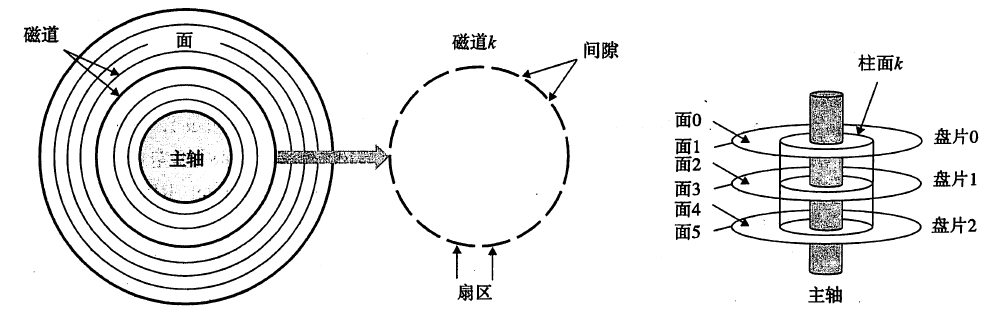
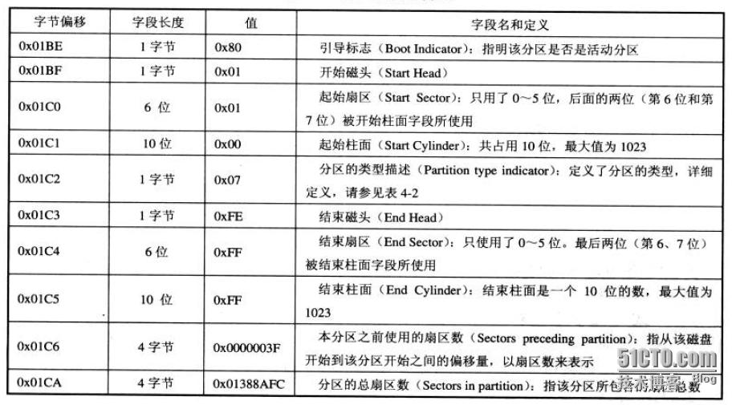
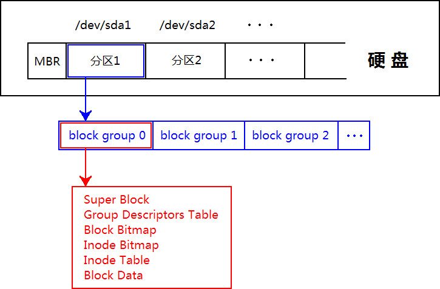

# linux文件系统解析
本文从最底层到上层，一层层解析linux文件系统的知识，能够对文件系统及存储有个全面认识。
磁盘 -> 文件系统 -> vfs -> 分布式文件系统

## 磁盘


磁道
柱面
扇区 512字节

### mbr
 MBR磁盘分区是一种使用最为广泛的分区结构，它也被称为DOS分区结构，但它并不仅仅应用于Windows系统平台，也应用于Linux，基于X86的UNIX等系统平台。它位于磁盘的0号扇区一扇区等于512字节），是一个重要的扇区简称MBR扇区）。

 MBR扇区由以下四部分组成：
 引导代码：引导代码占MBR分区的前440字节，负责整个系统启动。如果引导代码被破坏，系统将无法启动
 MBR分区表：占Windows磁盘标签后面的64个字节，是整个硬盘的分区表,每个分区表16字节，所以只能有4个主分区。
 MBR结束标志：占MBR扇区最后2个字节，一直为“55 AA”。



分区总扇区数 (2**(4*8))* 512=2199023255552 Bytes = 2T


### GPT


## ext2文件系统



### 超块
所谓 ext 文件系统的 super block，就是硬盘分区开头（开头的第一个 byte 是 byte 0）从 byte 1024 开始往后的一部分数据。由于 block size 最小是 1024 bytes，所以 super block 可能是在 block 1 中（此时 block 的大小正好是 1024 bytes），也可能是在 block 0 中。
*  inode 总数
* block 总数
* 分区的 block 大小
* 开始写数据的第一个 block
* ......

### 块组描述表
继续往下，看跟在 super block 后面的一堆 group descriptors。首先注意到 super block 是从 byte 1024 开始，一共有 1024 bytes 那么大。而 group descriptors 是从 super block 后面的第一个 block 开始。也就是说，如果 super block 是在 block 0，那么 group descriptors 就是从 block 1 开始；如果 super block 是在 block 1，那么 group descriptors 就是从 block 2 开始。因为 super block 一共只有 1024 bytes 那么大，所以不会超出一个 block 的边界。如果一个 block 正好是 1024 bytes 那么大的话，我们看到 group descriptors 就是紧跟在 super block 后面的了，没有留一点空隙。而如果一个 block 是 4096 bytes 那么大的话，那么在 group descriptors（从 byte 4096 开始）和 super block 的结尾之间，就有一定的空隙（4096 - 2048 bytes）。

那么硬盘分区上一共有多少个 block group，或者说一共有多少个 group descriptors，这我们要在 super block 中找答案。super block 中的 s_blocks_count 记录了硬盘分区上的 block 的总数，而 s_blocks_per_group 记录了每个 group 中有多少个 block。显然，文件系统上的 block groups 数量，我们把它记作 G，G = (s_blocks_count - s_first_data_block - 1) / s_blocks_per_group + 1。为什么要减去 s_first_data_block，因为 s_blocks_count 是硬盘分区上全部的 block 的数量，而在 s_first_data_block 之前的 block 是不归 block group 管的，所以当然要减去。最后为什么又要加一，这是因为尾巴上可能多出来一些 block，这些 block 我们要把它划在一个相对较小的 group 里面。
注意，硬盘分区上的所有这些 group descriptors 要能塞在一个 block 里面。也就是说 groups_count * descriptor_size 必须小于等于 block_size。

```
struct ext3_group_desc
{
 __u32 bg_block_bitmap;      /* block 指针指向 block bitmap */
 __u32 bg_inode_bitmap;      /* block 指针指向 inode bitmap */
 __u32 bg_inode_table;       /* block 指针指向 inodes table */
 __u16 bg_free_blocks_count; /* 空闲的 blocks 计数 */
 __u16 bg_free_inodes_count; /* 空闲的 inodes 计数 */
 __u16 bg_used_dirs_count;   /* 目录计数 */
 __u16 bg_pad;               /* 可以忽略 */
 __u32 bg_reserved[3];       /* 可以忽略 */
};
```

### inode
读取文件首先要读的，当然是文件系统的根目录。注意，这里所谓的根目录，是相对于这一个文件系统或者说硬盘分区而言的，它并不一定是整个 Linux 操作系统上的根目录。这里的这个 root 目录存放在一个固定的 inode 中，这就是文件系统上的 inode 2。需要提到 inode 计数同 block 计数一样，也是全局性质的。这里需要特别注意的是，inode 计数是从 1 开始的，而前面我们提到过 block 计数是从 0 开始，这个不同在开发程序的时候要特别留心。

## ext3

* 日志系统
* 在线调整（增长）
* 目录搜索改进htree

局限
- Ext3 目前所支持的最大 16TB 文件系统和最大 2TB 文件
- Ext3 目前只支持 32,000 个子目录


## ext4

* Large file system

The ext4 filesystem can support volumes with sizes up to 1 exbibyte (EiB) and files with sizes up to 16 tebibytes (TiB).[11] However, Red Hat recommends using XFS instead of ext4 for volumes larger than 100 TB.[12][13]
* Extents

Extents replace the traditional block mapping scheme used by ext2 and ext3. An extent is a range of contiguous physical blocks, improving large file performance and reducing fragmentation. A single extent in ext4 can map up to 128 MiB of contiguous space with a 4 KiB block size.[3] There can be four extents stored in the inode. When there are more than four extents to a file, the rest of the extents are indexed in a tree.[14]
* Backward compatibility

ext4 is backward compatible with ext3 and ext2, making it possible to mount ext3 and ext2 as ext4. This will slightly improve performance, because certain new features of ext4 can also be used with ext3 and ext2, such as the new block allocation algorithm.

ext3 is partially forward compatible with ext4.
 Practically, ext4 won't mount as an ext3 filesystem out of the box, unless certain new features are disabled when creating it, and those would be:
  ^extent,^flex_bg,^huge_file,^uninit_bg,^dir_nlink,^extra_isize as -O options of the mke2fs tool.[15]
* Persistent pre-allocation

ext4 can pre-allocate on-disk space for a file. To do this on most file systems, zeros would be written to the file when created. In ext4 (and some other files systems such as XFS) fallocate(), a new system call in the Linux kernel, can be used. The allocated space would be guaranteed and likely contiguous. This situation has applications for media streaming and databases.
* Delayed allocation

ext4 uses a performance technique called allocate-on-flush also known as delayed allocation. That is, ext4 delays block allocation until data is flushed to disk. (In contrast, some file systems allocate blocks immediately, even when the data goes into a write cache.) Delayed allocation improves performance and reduces fragmentation by effectively allocating larger amounts of data at a time.
* Unlimited number of subdirectories

Ext4 allows an unlimited number of subdirectories. (In ext3 a directory can have at most 32,000 subdirectories.)[16] To allow for larger directories and continued performance, ext4 turns on HTree indexes (a specialized version of a B-tree) by default. This feature is implemented in Linux 2.6.23. In ext3 HTrees can be used by enabling the dir_index feature.
* Journal checksumming

ext4 uses checksums in the journal to improve reliability, since the journal is one of the most used files of the disk. This feature has a side benefit: it can safely avoid a disk I/O wait during journaling, improving performance slightly. Journal checksumming was inspired by a research paper from the University of Wisconsin, titled IRON File Systems[17] (specifically, section 6, called "transaction checksums"), with modifications within the implementation of compound transactions performed by the IRON file system (originally proposed by Sam Naghshineh in the RedHat summit).
* Faster file system checking

In ext4 unallocated block groups and sections of the inode table are marked as such. This enables e2fsck to skip them entirely and greatly reduces the time it takes to check the file system. Linux 2.6.24 implements this feature.

fsck time/Inode Count(ext3 vs. ext4)

* Multiblock allocator

When ext3 appends to a file, it calls the block allocator, once for each block. Consequently, if there are multiple concurrent writers, files can easily become fragmented on disk. However, ext4 uses delayed allocation which allows it to buffer data and allocate groups of blocks. Consequently the multiblock allocator can make better choices about allocating files contiguously on disk. The multiblock allocator can also be used when files are opened in O_DIRECT mode. This feature does not affect the disk format.
* Improved timestamps

As computers become faster in general and as Linux becomes used more for mission-critical applications, the granularity of second-based timestamps becomes insufficient. To solve this, ext4 provides timestamps measured in nanoseconds. In addition, 2 bits of the expanded timestamp field are added to the most significant bits of the seconds field of the timestamps to defer the year 2038 problem for an additional 204 years.

ext4 also adds support for date-created timestamps. But, as Theodore Ts'o points out, while it is easy to add an extra creation-date field in the inode (thus technically enabling support for date-created timestamps in ext4), it is more difficult to modify or add the necessary system calls, like stat() (which would probably require a new version) and the various libraries that depend on them (like glibc). These changes would require coordination of many projects. So even if ext4 developers implement initial support for creation-date timestamps, this feature will not be available to user programs for now.[18][needs update]
* Transparent encryption

Support for transparent encryption was added in Linux kernel 4.1 on June 2015.[19]


## vfs(虚拟文件系统交换器)

VFS 是一种软件机制，也许称它为 Linux 的文件系统管理者更确切点，与它相关的数据结构只存在于物理内存当中。所以在每次系统初始化期间，Linux 都首先要在内存当中构造一棵 VFS 的目录树(在 Linux 的源代码里称之为 namespace)，实际上便是在内存中建立相应的数据结构。VFS 目录树在 Linux 的文件系统模块中是个很重要的概念，希望读者不要将其与实际文件系统目录树混淆，在笔者看来，VFS 中的各目录其主要用途是用来提供实际文件系统的挂载点，当然在 VFS 中也会涉及到文件级的操作，本文不阐述这种情况。下文提到目录树或目录，如果不特别说明，均指 VFS 的目录树或目录。往下对接底层的文件系统，如上面介绍的 ext4 fs等等。


在顶层是打开的 file 对象，它由进程的文件描述符列表引用。file 对象引用 dentry 对象，后者引用 inode。inode 和 dentry 对象都引用底层的 super_block 对象。可能有多个文件对象引用同一个 dentry（当两个用户共享同一个文件时）。注意，在图 7 中一个 dentry 对象还引用另一个 dentry 对象。在这里，目录引用文件，而文件反过来引用特定文件的 inode。

### 超块
超块（superblock）是关于文件系统的高级元数据的容器。超块是存在于磁盘上（实际上位于磁盘的多个位置上，以提供冗余）的结构。它是处理磁盘上的文件系统的基础，因为它定义文件系统的管理参数（例如，块的总数、空闲块和根索引节点）。

在磁盘上，超块向内核提供关于磁盘上的文件系统的结构的信息。在内存中，超块为管理活动的（已挂载）文件系统提供必要的信息和状态。因为 Linux 支持同时挂载多个并发文件系统，所以在一个列表中维护每个 super_block 结构（super_blocks 在 ./linux/fs/super.c 中定义，结构在 /linux/include/fs/fs.h 中定义）。

super_block 结构是指封装了其他信息的许多其他结构。例如，file_system_type 结构维护文件系统的名称（比如 ext3）以及各种锁和函数，以获取和删除 super_block。file_system_type 对象由常见的 register_file system 和 unregister_file system 函数管理（见 ./linux/fs/file systems.c）。super_operations 结构为读写节点和高级操作（比如重新挂载）定义大量函数。根目录条目（dentry）对象也缓存在这里，因为它是文件系统所在的块设备。最后，提供许多用于管理节点的列表，包括 s_inodes（列出所有节点的列表）、s_dirty（列出所有脏节点的列表）、s_io 和 s_more_io 以及 s_files（列出特定文件系统的所有打开文件的列表）。

### 索引节点

Linux 通过一个称为 inode（index node 的缩写）的对象管理文件系统中的所有对象。一个 inode 可以引用一个文件、目录或另一个对象的符号链接。注意，因为文件用于表示其他类型的对象（比如设备或内存），所以也使用 inode 来表示它们。

我在这里所指的 inode 是 VFS 层 inode（常驻 inode）。每个文件系统也包含一个位于磁盘上的 inode，并且提供关于特定文件系统的特定对象的细节。

inode 由描述 inode、inode 内容和可能在 inode 上发生的各种操作的数据和操作组成。图 4 简单展示了一个 VFS inode，该 inode 包含许多列表，其中一个列表指向引用该 inode 的 dentry。这里还包含对象级别的元数据，包括熟悉的操作时间（创建时间、访问时间和修改时间）和所有者和权限数据（组 ID、用户 ID 和权限）。inode 引用它所允许的文件操作，大部分这些操作直接映射到系统调用接口（例如，open、read、write 和 flush）。inode 还引用特定于 inode 的操作（create、lookup、link 和 mkdir 等等）。最后，对于由地址空间对象表示的对象的数据，有一个管理结构。地址空间对象 是为 inode 管理页缓存中的各种页的对象。地址空间对象用于为文件管理页，也用于将文件部分映射到独立的进程地址空间。地址空间对象有自己的操作集（writepage、readpage 和 releasepage 等等）。

### 目录条目

文件系统的层次结构由 VFS 中的另一个称为 dentry 的对象管理。文件系统有一个根 dentry（在超块中引用），这是唯一没有父对象的 dentry。所有其他 dentry 都有父对象，并且一部分 dentry 有子对象。例如，如果打开一个由 /home/user/name 组成的文件，那么将创建 4 个 dentry 对象：一个针对根 /、一个针对根目录 home 的条目、一个针对 user 目录的 name 条目，以及一个针对 user 目录的 name 条目。通过这种方式，dentry 简洁地映射到现在使用的文件系统。

它由许多元素组成，这些元素在文件系统和物理数据中跟踪条目之间的关系（比如文件名）。图 5 展示了 dentry 对象的简化图示。dentry 引用 super_block，super_block 定义包含该对象的特定文件系统实例。接下来是该对象的父 dentry（父目录），其后是包含在一个列表中的子 dentry（如果该对象刚好是一个目录的话）。然后，为 dentry 定义操作（比如 hash、compare、delete 和 release 等等）。接着定义对象的名称，在这里名称保存在 dentry 中而不是 inode 中。最后，提供一个到 VFS inode 的引用。

### 文件对象

在 Linux 系统中打开的每个文件都都存在一个 file 对象。这个对象为特定用户提供打开的实例的信息。图 6 提供了文件对象的简化视图。在图中可以看到，path 结构提供到 dentry 和 vfsmount 的引用。为每个文件定义了一组文件操作，常见的文件操作包括 open、close、read、write 和 flush 等。接着定义一组标志和权限（包括组和所有者）。最后，为特定文件实例定义状态数据，比如文件的当前偏移量。

## 分布式存储系统

分布式文件系统架构一般都架构在linux文件系统之上，以ceph为例，ceph的底层osd就可以使用xfs的文件系统。这里以ceph块存储为例，其它再补充。

一个块被ceph创建出来后，其底层为分割为4Mb一个的文件存储在xfs上面。整个块在被挂载在操作系统上之后，操作系统会当作连续的空间进行使用，中间的转换由ceph完成。

and so on


# 参考
https://ext4.wiki.kernel.org/index.php/Ext4_Disk_Layout#Finding_an_Inode
http://www.ibm.com/developerworks/cn/linux/filesystem/ext2/
http://www.ibm.com/developerworks/cn/linux/l-virtual-filesystem-switch/
