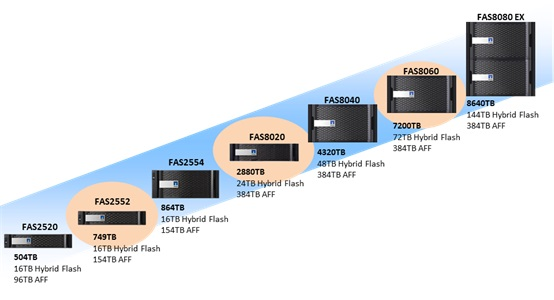
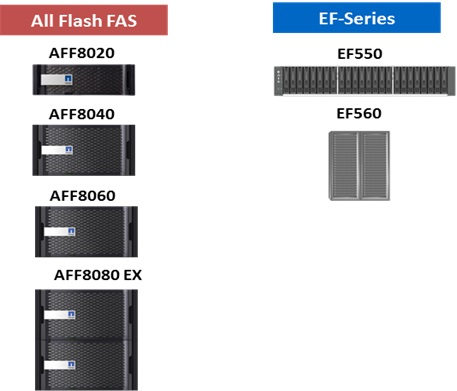
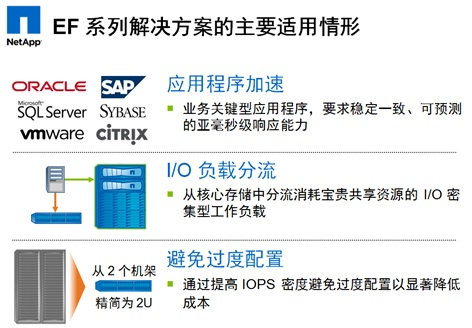
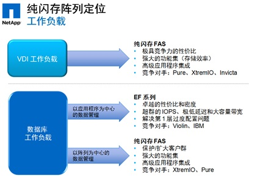
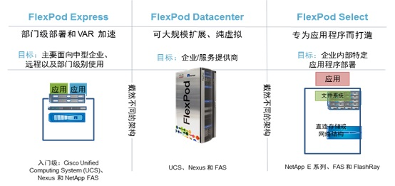

# netapp产品学习

## 产品介绍

### 硬件产品

#### FAS产品组合

入门级：FAS2520-2554

高端：FAS9000

数据说明:

- 172PB：支持的最大存储容量(HDD/SSD)
- 16TB：支持的最大缓存容量

#### EF系列——纯闪存（可全部支持SSD）

EF系列：将FAS硬盘存储全换成SSD，即AFF

#### E系列存储系统——高性能存储（专为SAN环境，性价比）

#### FlexPod 融合基础架构

运行集群模式 Data ONTAP 的 NetApp FAS
* 统一存储
* 智能数据管理

应用场景:需超长的应用程序正常运行时间；5个9的可用性条件下，达到高可用；保证存储的可以灵活拓展三大特点：
* 简单-安装使用
* 无缝-对接
* 简化-适应性各种环境，提高运行效率，降低电耗、密度和散热成本

### 软件产品

#### Data ONTAP

netapp的存储数据管理系统基于伯克利的BSD unix和其它一些操作系统技术，原始的ontap 只支持NFS，　后面陆续加入了SMB,iSCSI和FC(Fibre Channel)的支持。2006年６月１６日，netapp公司发布了data ontap系统的两个版本,Data ONTAP 7G 和 基于从Spinnaker Networks的网格技术完全重写的Data ONTAP GX.在2010年,这些特性又被合并在一个操作系统(Data ONTAP 8)中.Data ONTAP 7G 被合并进GX的集群平台中.所以Data ONTAP 8 有两个不同的操作模式, 7-mode 和 cluster-mode.

### 系统架构组成

#### netapp产品的架构
netapp产品由raid-DP, NVRAM(非易失性随机访问存储器，专利号:5,948,110), SNAPSHOT(copy-on-write机制),WAFL(底层文件系统，专利号:5,819,292),A-SIS(重复数据删除技术)，闪存卡

##### raid-DP
netapp在raid4的基础上提出来的奇偶双校验raid，在原raid4的校验盘基础上，再加了一块对角线的校验盘，达到双校验的目的。

##### NVRAM
有电池保护的NVRAM（非易失性内存），它用于netapp的日志(journal)，保证主机断电情况下，正在写的数据不丢失，为写数据加速

##### SNAPSHOT
基于CopyOnWrite原理实现的快照功能

##### WAFL文件系统

以上三个特点支撑，WAFL结合NVRAM、RAID、Snapshot的设计出的文件系统。
WAFL的主要特点及其所带来的优势包括：
永远一致性的文件系统：任何时刻文件系统均处于一致性的状态，即使遇到非正常断电或不正常关机后，也不需执行硬盘检查，即可在复电后2分钟内迅速提供服务。
具电池保护的NVRAM日志：利用存取速度较硬盘快一千倍的内存，担任文件系统的日志，同时保护metadata及data的交易纪录，并加速写入的效率和反应时间、保证文件系统的一致性、保证写入的交易不会因断电而流失。
内建智能型最佳化的RAID磁盘阵列管理系统：配合NVRAM日志功能，藉由硬盘区块的配置最佳化，可将大量的随机写入转为少量的循序写入，真正达到平行写入 (Stripe Write) 并减少磁头移动的次数和磁头移动的距离的目的，加速文件存取和搜寻的速度。
能增长的文件系统：不需其它软件的协助，就可直接实时动态线上扩增文件系统容量且立刻能使用新增加的容量。每次可只增加一块硬盘或多块硬盘的方式来扩增，完全不需要停机，也不需要等待时间。另外也可在不扩增容量的前提下，动态线上提高文件数量的上限，完全不需要停机，也不需要等待时间，也不影响系统运作效率。
瞬间快照备份 (Snapshot)：使用不需要移动硬盘区块的WAFL专利技术，可瞬间备份整个文件系统，每个volume可有255份快照，每个使用者都有自己专属的一个快照目录，可自行恢复只属于自己在任一快照时间点的资料，完全不需系统管理人员的协助。每个快照备份皆是完整的文件系统备份 (Full File System Backup)，不论已有多少份数的备份，系统运作效率皆不受影响。

##### 闪存卡
在较新的fas系列产品中，默认带闪存卡，来为读数据加速，最小配置为512G

#### netapp性能

以性能评审数据为参考,看下来差不多为线性增长的趋势
硬盘 : 450GB, 15K, SAS HDD：
闪存：Flash Cache Module 512GB

架构|IOPS|ORT|协议|内存(GB)|磁盘数|容量|网络端口|网络类型|
----------|-----|------|---------|--------------|------|--------|--------------|----------------|
Data ONTAP 8.1 Cluster-Mode (4-node FAS6240)|260388 	|1.53|NFS V3|2256|288|48T|12|Jumbo frame 10 Gigabit Ethernet|
Data ONTAP 8.1 Cluster-Mode (8-node FAS6240)|512667 	|1.54|NFS V3|4512|576|96T|24|Jumbo frame 10 Gigabit Ethernet|
Data ONTAP 8.1 Cluster-Mode (12-node FAS6240)|765667 	|1.55|NFS V3|6768|864|144T|36|Jumbo frame 10 Gigabit Ethernet|
Data ONTAP 8.1 Cluster-Mode (16-node FAS6240)|1007052 	|1.48|NFS V3|9024|1152|192T|48|Jumbo frame 10 Gigabit Ethernet|
Data ONTAP 8.1 Cluster-Mode (20-node FAS6240)|1261145 	|1.56|NFS V3|11280|1440|240T|60|Jumbo frame 10 Gigabit Ethernet|
Data ONTAP 8.1 Cluster-Mode (24-node FAS6240)|1512784 	|1.53|NFS V3|13536|1728|288T|72|Jumbo frame 10 Gigabit Ethernet|

#### 小规模高性能原因
netapp在磁盘数很小的情况也能提供较高的IOPS的原因，就是因为默认配置了闪存卡，最小每个机头为512G。

以官方数据，同样提供40000IOPS(其它数据见文档)的性能的设备，配置闪存卡和不配置闪存卡的比较。

配置闪存卡 仅需 54块sas 盘即可满足性能要求。
不配置闪存卡 需要 214块sas盘才能达到性能要求。

### 对接openstack推荐
由于netapp底层基于WAFL文件系统，厂商推荐直接使用NFS对接，不建议使用ISCSI对接。

### manila支持

操作系统需要支持 `cluster-mode` 及以上才能对接manila

## reference

- http://netapp.github.io/openstack-deploy-ops-guide/liberty/content/ch_executive-summary.html
- https://en.wikipedia.org/wiki/NetApp
- http://www.spec.org/sfs2008/results/sfs2008.html
- http://www.taodocs.com/p-1588095.html
- http://www.datadisk.co.uk/html_docs/netapp/netapp_arch.htm
- http://www.sansky.net/article/2007-12-12-netapp-wafl.html
- http://www.sansky.net/article/2007-12-16-netapp-snapshot.html
